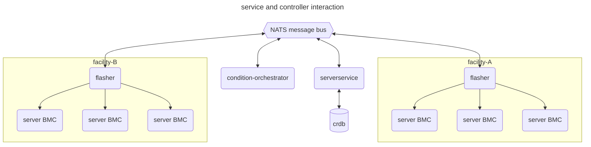
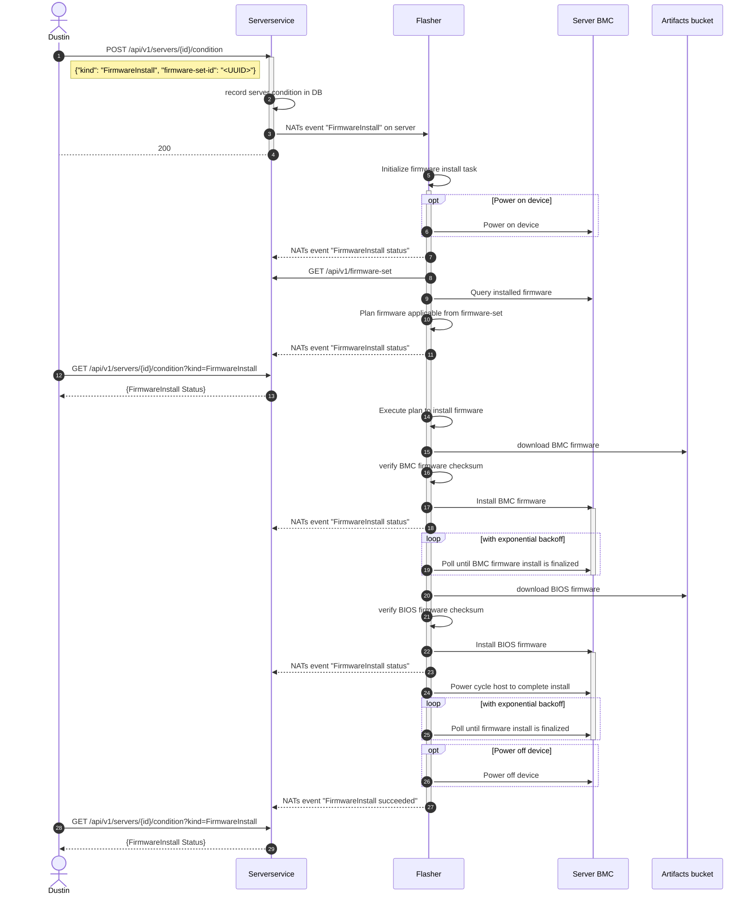
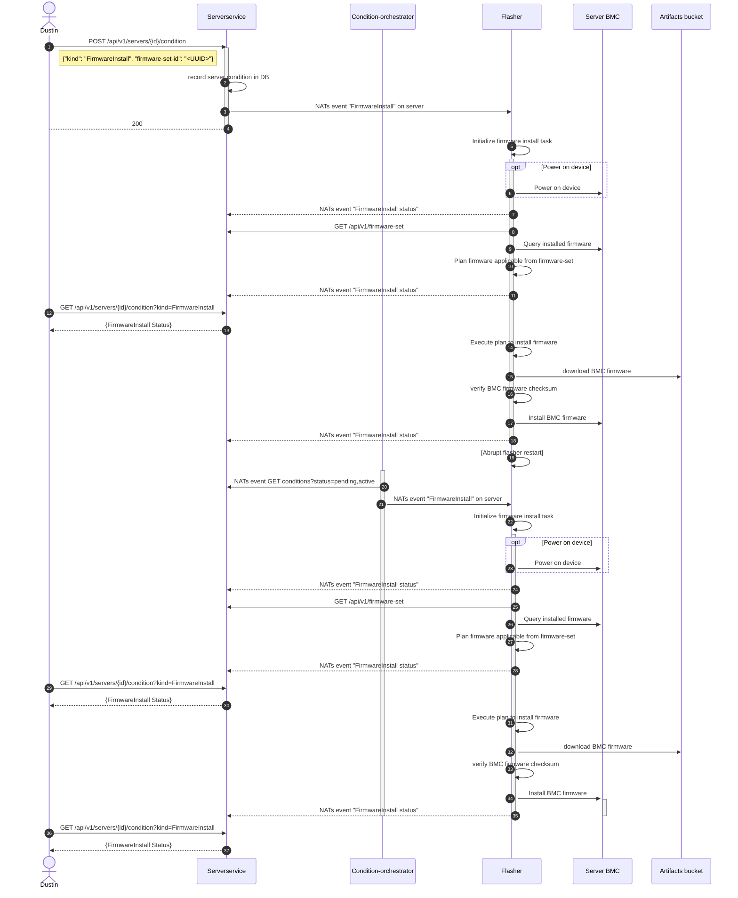

### Table of contents
1. [Introduction](#introduction)
2. [Concepts](#concepts)
    1. [Conditions](#conditions)
    2. [Controllers](#controllers)
    3. [Locks](#locks)
3. [Messaging](#messaging)
    1. [Message schema](#message-schema)
4. [Architecture](#architecture)
5. [Process](#process)
    1. [Failure modes and recovery](#failure-modes-and-recovery)
        1. [Expectations after a failure](#expectations-after-a-failure)
    2. [Out of band firmware install](#successful-out-of-band-firmware-install)
    3. [Flasher abrupt failure](#flasher-abrupt-failure)


## Introduction

The Firmware install as a service is to expose a single API to consumers which with enable them to,

 - Install and ensure firmware(s)/firmware-set(s) on a server.
 - Check the current status of a firmware install.

This document introduces the services part of the whole and how they interact. As of now this serves as an initial design document and will be kept updated based on changes to the system.

## Concepts

Firmware install as a service depends on various platform services and a few constructs defined on top of Serverservice to function in an event driven and scalable manner.

This section covers an overview of those technologies and constructs for reference.


#### Conditions

- A *condition* is represents an action to be reconciled on a server by a controller (Flasher, Alloy, PBnJ)
- A *condition* is an object associated with a server.
- A server may have one or more unique *conditions* associated with it, that is - it cannot have two or more `firmwareInstall` conditions associated with it at any given instant.
- *Conditions* are modelled around the k8s [`podConditions`](https://kubernetes.io/docs/concepts/workloads/pods/pod-lifecycle/#pod-conditions)
- The *kinds* of *conditions* that could exist depends on the controllers present.
- Each *condition* has a 'kind' attribute which could be one of - `firmwareInstall`, `inventoryOOB`, `powerCycleHard`, `powerCycleSoft` etc.
- The *condition* object consists of the following fields,

```json
{
 "kind": "firmwareInstall",
 "status": "pending", // updated by the controller
 "data": { ... }, // updated by the controller
 "controller": "<controller generated identifier>", // set by the controller
 "created_at": timestamp,
 "updated_at": timestamp,
 "lock": int64,
}
```
- The status field may only contain one of the following values  `pending`, `active`, `failed`, `succeeded`.
- A *condition* starts in the `pending` state and finalizes in either the `failed`, `suceeded` states.

#### Controllers

- Controllers listen for work on the NATs message bus - the message subject, format is to be decided, but the message is to encapsulate the *condition* as is.
- When controllers receive a *condition* message it can act on, it begins its work.
- Controllers are services reconcile *conditions* to a finalized state.
- Controllers transition and keep the *condition* updated based on its work.
- Controller send a message on the NATs message bus to update the `state`, `data` attributes.
- Controllers should not modify the condition `kind` attribute.
- When updating the `status` or `data` attributes, the controller must pass the original `lock` value from the previous operation where it received this value, Serverservice will not accept a `PUT` OR a message to update a Condition if the `lock` value does not match the existing, this mechanism functions as an [optimistic lock](https://en.wikipedia.org/wiki/Optimistic_concurrency_control).
- Controllers are to resend a message in case of a failure - in either sending the message or if the original update was rejected by Serverservice.
- Controllers are expected to drop unrelated or duplicate messages.
- [TODO] How does a controller reclaim, retry a *condition* after an abrupt restart/failure.

#### Locks

> Note: this construct needs more brainstorming and review before implementation.

Locks are a Serverservice construct to restrict the number of controllers acting on the same device at the same instant.

They are an exclusive lock for the device BMC access (atleast for now).

A controller acting to finalize a condition on a device obtains a lock - only if the condition its deals with can fail in a disruptive manner, or that condition could affect other conditions that may be currently `active` on the BMC.

Examples of possibly disruptive conditions are - `firmwareInstall`, `powerCycleHost` (not exhaustive).

The below cases describe situations where device locks will prove useful.

case 1

- If theres a two conditions `firmwareInstall`, `powerCycleHost` set on a device and they are in the `pending` status, each of them should be finalized serially (in order of timestamp or a priority value), so as not to affect each other.

case 2

- If the `firmwareInstall` condition is currently `active` on a device, and second condition `powerCycleHost` gets set to `pending`, this second condition should not be attempted to be finalized by its relevant controller (PBnJ?) until the `firmwareInstall` controller has released the lock.


#### Messaging

Controllers and services communicate through the NATS pubsub system (to begin with), further details are to be added once this is past the PoC phase.

##### Message schema

[TBD]

#### Condition orchestrator

The condition-orchestrator is a service that serves mainly two purposes,

- Lookup un-finalized *conditions* in Serverservice and publishes them with a time interval until they are finalized [level based triggers](https://hackernoon.com/level-triggering-and-reconciliation-in-kubernetes-1f17fe30333d).
- Garbage collect *conditions* in Serverservice that are found to be idle.

## Architecture

The firmware install service architecture tries to be as event driven as possible and comprises of the following services,

- [Flasher](https://github.com/metal-toolbox/flasher)
- [Serverservice](https://github.com/metal-toolbox/hollow-serverservice)
- Condition-orchestrator
- [NATs](https://docs.nats.io/)




### Process

The diagrams below depict the sequence of events for the Firmware install process.

#### Failure modes and recovery

The various kinds of failure modes we want to cover are,

- k8s node its running on goes down for maintenance.
- flasher pod is killed for reasons like consuming too much memory.
- flasher dies because of a panic in the code.
- flasher is just hung in some sort of loop, and does not continue to perform any action.

#### Expectations after a failure,

Flasher should be able to request for any remaining updates that are pending OR that work to be done is published periodically by the `condition-orchestrator` (level based triggers), which is then acted on.

Once flasher figures out work pending, it should - allow any currently running updates (on the BMC) to complete and proceed to install the remaining ones.

Operators of the system are notified the flasher process died abruptly along with any followup information.


#### Successful Out of band firmware install


This is the sequence diagram for a successful firmware install for the BIOS, BMC components, through the server BMC.

The request is received by Serverservice which then forwards requests on the NATs message bus.

Note: The `condition-orchestrator` is not depicted in the diagram, since it does not play as much of a role in this case.




#### Flasher abrupt failure

Sequence diagram for the case where the flasher service dies in middle of an update.

TODO: this needs more eyes and testing.





#### References

- https://github.com/wso2/reference-architecture/blob/master/event-driven-api-architecture.md
- https://hackernoon.com/level-triggering-and-reconciliation-in-kubernetes-1f17fe30333d
- https://github.com/kubernetes/community/blob/master/contributors/devel/sig-architecture/api-conventions.md#typical-status-properties
- https://github.com/kubernetes/community/blob/master/contributors/devel/sig-architecture/api-conventions.md#concurrency-control-and-consistency

