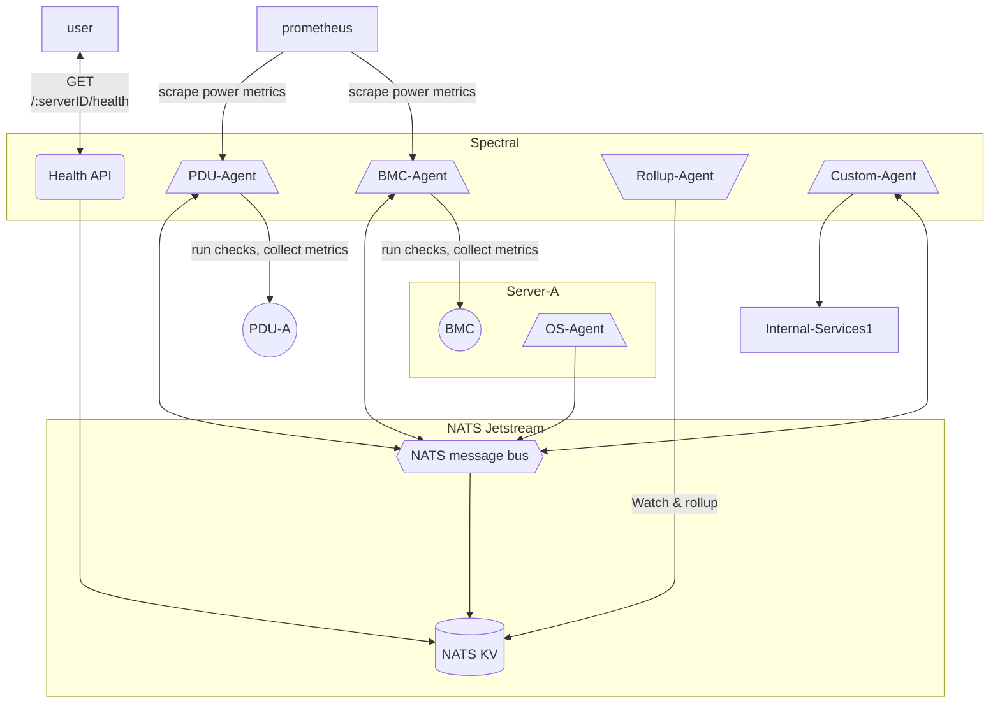
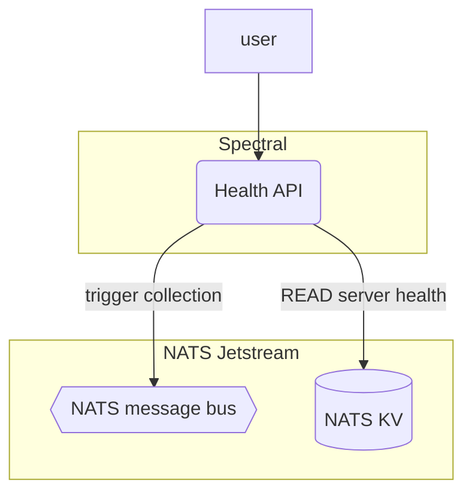
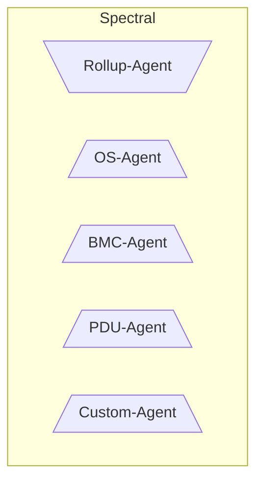
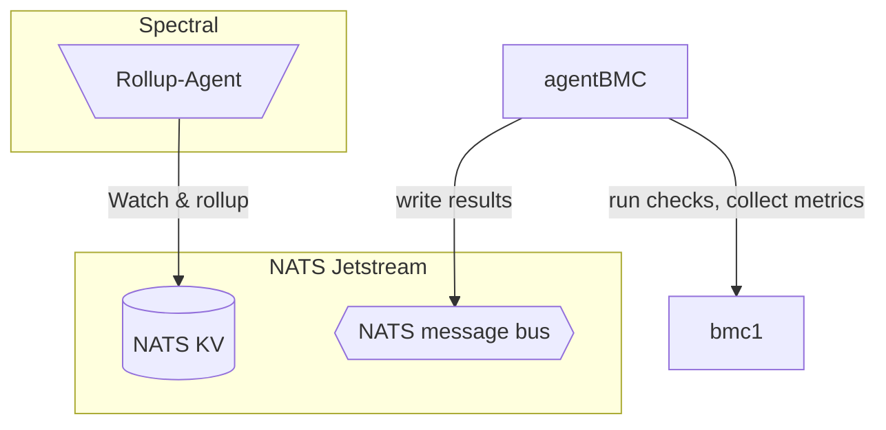
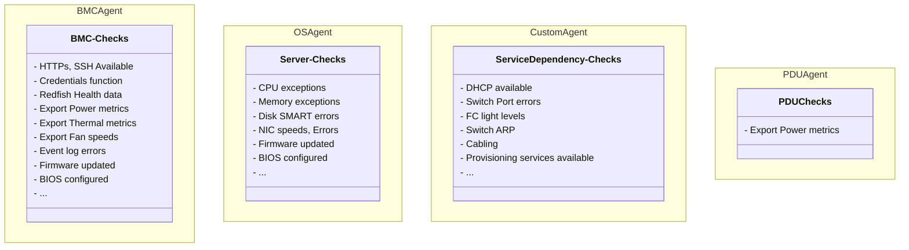

### Table of contents

## Introduction

This document proposes a system called `Spectral` to enable detection, debugging of server hardware faults, network connectivity
and server provisioning stack related dependencies which can negatively impact a server from functioning as expected in production.

The collected data is then analyzed and _reduced_ to `health states` like `OK`, `WARNING`, `CRITICAL` on a per-component and server basis.

The Server health information gathered is to be made available via an API on a per-server basis which can be leveraged by
operators/services/systems in their decision processes, the checks will include information to determine the cause and ownership of a problem.

Spectral aims to provide visibility into the faults as they occur, which will enable operators/services to automate remediation of faults,
and so reducing the mean time to detection and mean time to repair.

## Purpose

- Automate detection of server hardware issues and server environmental factors that would affect its use in production.
- Collect health information, analyse and have it available for consumption as real time as possible.
- API that exposes a per Server overview of the health status of each hardware component and overall health rollup.
- Reduce mean time to detection (MTTD) and mean time to repair (MTTR) for hardware component/network environment issues.
- Provide an overview of fleet health information.
- Export thermal and power metrics per server.

## Alternatives considered

- Alloy
  - Pros
    - Capable of collecting health information from Redfish.
  - Cons
    - Redfish health information is fairly limited.
    - Collection frequency is much lower.
    - Does not export power and thermal information.
    - Adding in health monitoring related logic will result in feature bloat.
- Prometheus
  - Pros
    - Capable of aggregating time series data.
  - Cons
    - Data to be collected is mainly be non-time series data.
    - Requires all data to be collected at higher intervals, while checks will execute at varying intervals.
- Nagios/Other check based monitoring systems
  - Pros
    - Has a built in check system.
    - Is fairly clunky to deploy and manage.
  - Cons
    - Is designed to be very generic and is not capable of interpreting check results for hardware health roll-ups.

## Spectral components

The diagram below depicts Spectral with its various components along with its NATS dependency.



Spectral comprises of the following components,

 - An API service
 - Health rollup agent
 - Check executor agents
 - Checks

These components are described further below.

Spectral depends on,

 - NATS Jetstream
 - NATS K/V store


### API
---




The Spectral API would serve user requests to query health information for a given server identifier, it will backed by the NATS k/v store.

The API would be GraphQL based.

Example endpoints would be,

`GET /api/v1/:serverID`

`GET /api/v1/:serverID/rollup`

`GET /api/v1/:serverID/:component/`

`GET /api/v1/:serverID/:component/rollup`

`POST /api/v1/:serverID`

### Agents
---



- The Spectral system provides agents which are capable of executing checks loaded as [plugins](https://github.com/hashicorp/go-plugin/tree/main).
- The plugin interface is to be defined based on what data is to be shared between the agent and check plugin and how this functions in practice.
- The results from each check plugin are then published to the NATS JS to the NATS K/V store.
- The agents are scoped to the the data collection mechanism is being collected.
- Operators define checks as plugins along with a definition of the order of execution.


### Health rollup agent
---



The health roll-up agent watches Server health information as it is updated by an Agent and updates the Server health roll-up information.

TODO: elaborate a bit more as the concept is hashed out.


### Check plugins
---

Checks are to be implemented as [plugins](https://github.com/hashicorp/go-plugin/tree/main) by the operator,
these plugins are grouped by the kind of agent and are made available to the agents for execution.

Various checks that could be implemented are listed below,




### Check definitions
---

The spec for check definition is to be formalized, these are just example definitions,
the definition is the runtime configuration for Spectral agents and is defined by operators.

Sample check definitions for the `BMCAgent`
```yaml
defaults:
    kind: "bmcAgent"
    # https://godoc.org/github.com/robfig/cron#hdr-CRON_Expression_Format
    schedule: "0 5 */4 * * *"

checks:
  - bmc_network:
      opdoc: "Check if the BMC network port is up and has no errors"
      owner: ["dcops"]
      tags: ["bmc", "network"]

   - bmc_available:
      opdoc: "BMC IP Address reachability and credential check"
      owner: ["dcops"]
      tags: ["bmc","network"]
      depends_on: ["bmc_network"]

   - bios_configured:
     opdoc: "Check the BIOS configuration is as expected"
     owner: ["dcops"]
     tags: ["bmc","network"]
     depends_on: ["bmc_network"]

   - firmware_updated:
     opdoc: "Check the firmware installed is up to date"
     owner: ["fleet"]
     tags: ["bmc","firmware"]
     depends_on: ["bmc_network"]
```


## References

#### Existing server hardware health monitoring systems
 - [Google's Hardware health monitoring system - see Chapter 7. Dealing with Failures and Repairs in Datcenter as a computer - PDF](https://www.morganclaypool.com/doi/10.2200/S00874ED3V01Y201809CAC046)
 - [Facebooks fault detection system](https://engineering.fb.com/2020/12/09/data-center-engineering/how-facebook-keeps-its-large-scale-infrastructure-hardware-up-and-running/)
 - [Hardware monitoring at CERN IT - PDF](https://indico.cern.ch/event/138424/contributions/1368452/attachments/116530/165396/HEPiX_October_2011.pdf)

#### Studies on server hardware failure analysis
  - [Large Scale Studies of Memory, Storage, and Network Failures in a Modern Data Center](https://safari.ethz.ch/safari_public_wp/wp-content/uploads/2019/01/justin-phd-thesis-December_25_2018.pdf)
  - [PDF - Failure Data Analysis of a Large-Scale Heterogeneous Server Environment](http://www.cse.psu.edu/~axs53/csl/papers/dsn04.pdf)
  - [PDF - The cost of retaining Aging IT infrastructure - Lenovo](https://www.asipartner.com/marketing/techzone2015/collateral/lenovo-wpidc-2014.pdf)